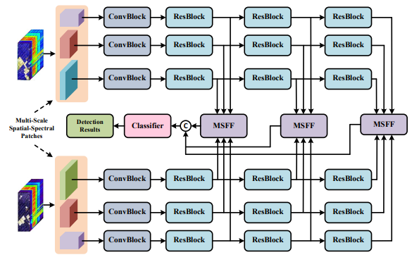

# Multiple Spatial-Spectral Features Aggregated Neural Network for Hyperspectral Change Detection --IEEE Geoscience and Remote Sensing Letters

Code for the paper "[Multiple Spatial-Spectral Features Aggregated Neural Network for Hyperspectral Change Detection](https://ieeexplore.ieee.org/abstract/document/10360861/)".  More specifically, it is detailed as follow. 



## Data

The datasets can be found in https://rslab.ut.ac.ir/data and  https://crabwq.github.io/.

## Citation

Please kindly cite the papers if this code is useful and helpful for your research.

 J. Ding, X. Li, J. Li and S. Chen, "Multiple Spatial–Spectral Features Aggregated Neural Network for Hyperspectral Change Detection," in *IEEE Geoscience and Remote Sensing Letters*, vol. 21, pp. 1-5, 2024, Art no. 5500605, doi: 10.1109/LGRS.2023.3343456.

```tex
@ARTICLE{ding2023multiple,
  author={Ding, Jigang and Li, Xiaorun and Li, Jingsui and Chen, Shuhan},
  journal={IEEE Geoscience and Remote Sensing Letters}, 
  title={Multiple Spatial–Spectral Features Aggregated Neural Network for Hyperspectral Change Detection}, 
  year={2024},
  volume={21},
  number={},
  pages={1-5},
  keywords={Feature extraction;Transformers;Convolution;Termination of employment;Redundancy;Kernel;Hyperspectral imaging;Attention mechanism;change detection (CD);hyperspectral image (HSI);multiscale features},
  doi={10.1109/LGRS.2023.3343456}}

```

